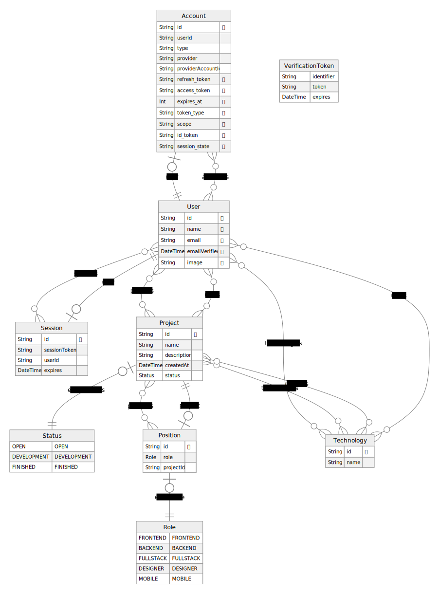

# Ascent Community API

## Our purpose

Ascent purpose is to create a platform for developers who needs to find a job for any reasons (layoffs, extra profit, etc).



## Requirements

- Node.js (20.9.0)
- PNPM (8.10.2)
- Docker (24.0.7)

## Installation

In the root folder of the project run:

```bash
pnpm install
```

## Usage

Follow the instructions of all .env.example.

<!-- - /apps/backend -->

- /apps/frontend
- /packages/db

## Starting

Then, start your local database. Make sure you have Docker installed on your computer:

```bash
pnpm db:start
```

## After that, deploy all migrations to the database:

```bash
pnpm db migrate:deploy
```

You can also populate the db using seed command:

```bash
pnpm db seed
```

## Now just run `dev` script to start all applications on development mode.

```bash
pnpm dev
```
